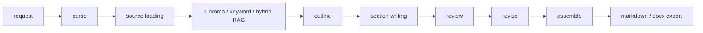

# LongTextAgent

LongTextAgent is a Python 3.11+ LangChain and LangGraph system for generating
long-form reports, project proposals, plans, research summaries, and weekly
reports. It uses a staged workflow: request parsing, source loading, RAG
retrieval, outline planning, section writing, review, revision, assembly, export,
checkpointing, and optional human review resume.



## Install

Windows PowerShell:

```powershell
py -3.11 -m venv .venv
.\.venv\Scripts\Activate.ps1
python -m pip install -U pip
python -m pip install -e ".[dev]"
```

Linux or macOS:

```bash
python3.11 -m venv .venv
source .venv/bin/activate
python -m pip install -U pip
python -m pip install -e ".[dev]"
```

Run checks:

```bash
ruff check .
pytest
```

## Environment

Copy `.env.example` to `.env`. Do not commit `.env`.

```env
LLM_PROVIDER=ollama
OLLAMA_BASE_URL=http://localhost:11434
OLLAMA_MODEL=qwen3.6:35b

EMBEDDING_PROVIDER=ollama
OLLAMA_EMBEDDING_MODEL=qwen3-embedding:8b

OPENAI_API_KEY=
OPENAI_BASE_URL=
OPENAI_MODEL=

DATA_DIR=./data
OUTPUT_DIR=./outputs
CHECKPOINT_DB_PATH=./outputs/checkpoints.sqlite
```

`doctor` checks Python version, paths, provider, model name, and secret-safe
configuration:

```bash
writing-agent doctor
```

Check Ollama or OpenAI-compatible model connectivity:

```bash
writing-agent check-model
```

For Ollama on Windows, `OLLAMA_BASE_URL` is normally
`http://localhost:11434`. In Docker-to-Windows-host scenarios,
`host.docker.internal` may be needed. If model checks fail, run `ollama serve`
and `ollama list`.

## Chroma Vector RAG

Build or reset a persistent local Chroma collection:

```bash
writing-agent index `
  --source ./data/forestry_notes.md `
  --collection forestry_demo `
  --reset
```

Retrieve chunks:

```bash
writing-agent retrieve `
  --query "林业知识问答系统如何构建知识库" `
  --collection forestry_demo `
  --top-k 5
```

RAG modes:

- `keyword`: term-overlap retrieval over loaded local chunks.
- `vector`: Chroma vector retrieval.
- `hybrid`: weighted fusion, vector score 0.7 and keyword score 0.3.

`outputs/chroma/` is ignored by Git.

## Generate A Report

```bash
writing-agent run `
  --topic "智慧林务系统建设计划书" `
  --type proposal `
  --audience "项目负责人和技术评审" `
  --length "5000字" `
  --style "正式、技术导向、少空话" `
  --source ./data/forestry_notes.md `
  --collection forestry_demo `
  --rag `
  --rag-mode hybrid `
  --top-k 5 `
  --output-format both `
  --thread-id forestry-plan-demo
```

`--output-format` supports `markdown`, `docx`, and `both`. The docx export
includes a title page, generation notes, heading mapping, paragraphs, ordered and
unordered lists, simple markdown tables, header, and footer.

## Human Review Resume

Pause after outline or before export:

```bash
writing-agent run --topic "智慧林务系统建设计划书" --thread-id forestry-plan-demo --pause-after-outline
writing-agent run --topic "智慧林务系统建设计划书" --thread-id forestry-plan-demo --pause-before-export
```

Create a review file:

```bash
echo "提纲整体可用，但请增加系统评估、部署风险、数据安全章节。" > review.md
```

Resume from the LangGraph checkpoint:

```bash
writing-agent resume `
  --thread-id forestry-plan-demo `
  --review-file review.md
```

List and inspect checkpoint metadata:

```bash
writing-agent threads
writing-agent inspect --thread-id forestry-plan-demo
```

## Evaluation

Rule-based evaluation:

```bash
writing-agent evaluate --file outputs/<generated_file>.md
writing-agent evaluate --file outputs/<generated_file>.md --json
```

Optional LLM Judge:

```bash
writing-agent evaluate --file outputs/<generated_file>.md --llm-judge
```

Rule metrics are stable deterministic indicators: word/character count, heading
counts, section count, abstract/conclusion/reference detection, repeated
paragraph ratio, `依据不足` count, and generic phrase risk terms such as `赋能`,
`高质量发展`, `形成闭环`, `显著提升`, `多措并举`, `夯实基础`, and `智能化水平`.

LLM Judge is subjective and may vary by model. It scores structure, logic,
evidence, specificity, audience fit, actionability, risk awareness, and overall
quality. Important deliverables still need human review.

## Citation Verification

Verify generated citations against the local index manifest:

```bash
writing-agent verify-citations `
  --file outputs/xxx.md `
  --collection forestry_demo
```

JSON output:

```bash
writing-agent verify-citations `
  --file outputs/xxx.md `
  --collection forestry_demo `
  --json
```

`evaluate` can include citation verification:

```bash
writing-agent evaluate `
  --file outputs/xxx.md `
  --verify-citations `
  --collection forestry_demo
```

Supported citation formats include:

- `[source: path#chunk_id]`
- `[source_path: xxx, chunk_id: yyy]`
- `source_path=xxx; chunk_id=chunk_001`
- items in a `参考依据` list

## Collection Management

```bash
writing-agent collections list
writing-agent collections stats --collection forestry_demo
writing-agent collections export-manifest --collection forestry_demo --output manifest.json
writing-agent collections rebuild --collection forestry_demo --source ./data/forestry_notes.md
writing-agent collections delete --collection forestry_demo --yes
```

Index manifests are written to `outputs/index_manifests/` and are ignored by
Git because they may contain local paths and document metadata.

## DOCX Templates

Run with a user template:

```bash
writing-agent run `
  --topic "智慧林务系统建设计划书" `
  --type proposal `
  --audience "项目负责人和技术评审" `
  --length "5000字" `
  --style "正式、技术导向、少空话" `
  --collection forestry_demo `
  --rag `
  --rag-mode hybrid `
  --output-format docx `
  --docx-template ./templates/proposal_template.docx `
  --thread-id forestry-template-demo
```

Supported placeholders:

- `{{title}}`
- `{{topic}}`
- `{{document_type}}`
- `{{audience}}`
- `{{generated_at}}`
- `{{model_name}}`
- `{{rag_mode}}`
- `{{collection}}`
- `{{thread_id}}`
- `{{body}}`

If `{{body}}` is missing, the generated body is appended to the end and a warning
is recorded. Word table-of-contents fields must be refreshed in Microsoft Word
by right-clicking and updating the field.

## Batch Runs

Example task file: `examples/eval_tasks.jsonl`.

```bash
writing-agent batch-run `
  --tasks examples/eval_tasks.jsonl `
  --output-dir outputs/batch `
  --rag-mode hybrid `
  --collection forestry_demo `
  --output-format markdown
```

Batch evaluation:

```bash
writing-agent batch-evaluate `
  --input-dir outputs/batch `
  --json-output outputs/batch_eval.json
```

`batch-run` uses one `thread_id` per task and keeps going if a task fails.
`batch-evaluate` summarizes average words, sections, repeated paragraph ratio,
insufficient-evidence count, and total risk-term hits.

Rerun failed tasks:

```bash
writing-agent batch-rerun-failed `
  --failed-tasks outputs/batch/<run_id>/failed_tasks.jsonl `
  --output-dir outputs/batch/<new_run_id> `
  --collection forestry_demo
```

Each batch run writes:

- `task_outputs/`
- `batch_report.json`
- `failed_tasks.jsonl`
- `run_config.json`

## LangSmith Tracing

Optional `.env` values:

```env
LANGSMITH_TRACING=false
LANGSMITH_API_KEY=
LANGSMITH_PROJECT=writing-agent-local
LANGSMITH_ENDPOINT=
```

Check tracing configuration without exposing the API key:

```bash
writing-agent trace-check
```

`batch-run` supports `--trace/--no-trace`; tracing is off by default.

## Baseline Evaluation

Run a fixed baseline:

```bash
writing-agent baseline-run `
  --tasks examples/baseline_tasks.jsonl `
  --collection forestry_demo `
  --rag-mode hybrid `
  --output-dir outputs/baseline
```

The run writes `baseline_summary.json` with commit hash, model name, embedding
model, RAG mode, collection, success/failure counts, average rule score,
average citation valid rate, and average insufficient-evidence count.

Use baseline summaries to compare different commits, models, embedding models,
and RAG modes.

## Recommended Engineering Flow

1. Index the collection.
2. Retrieve a few sanity-check chunks.
3. Run one document.
4. Verify citations.
5. Evaluate the document.
6. Run a batch.
7. Batch-evaluate outputs.
8. Run baseline.
9. Compare baseline summaries across commits, models, and RAG modes.

## Known Limits

- Chroma vector quality depends on the configured embedding model.
- The current hybrid fusion strategy is intentionally simple.
- LLM Judge is optional and should not replace human review.
- docx export supports common markdown structures, not full markdown syntax.
- Web search, advanced citation verification, and styled docx templates remain future work.
