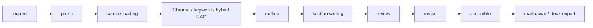

# LongTextAgent

LongTextAgent is a Python 3.11+ LangChain and LangGraph system for generating
long-form reports, project proposals, plans, research summaries, and weekly
reports. It uses a staged workflow: request parsing, source loading, RAG
retrieval, outline planning, section writing, review, revision, assembly, export,
checkpointing, and optional human review resume.



## Install

Windows PowerShell:

```powershell
py -3.11 -m venv .venv
.\.venv\Scripts\Activate.ps1
python -m pip install -U pip
python -m pip install -e ".[dev]"
```

Linux or macOS:

```bash
python3.11 -m venv .venv
source .venv/bin/activate
python -m pip install -U pip
python -m pip install -e ".[dev]"
```

Run checks:

```bash
ruff check .
pytest
```

## Environment

Copy `.env.example` to `.env`. Do not commit `.env`.

```env
LLM_PROVIDER=ollama
OLLAMA_BASE_URL=http://localhost:11434
OLLAMA_MODEL=qwen3.6:35b

EMBEDDING_PROVIDER=ollama
OLLAMA_EMBEDDING_MODEL=qwen3-embedding:8b

OPENAI_API_KEY=
OPENAI_BASE_URL=
OPENAI_MODEL=

DATA_DIR=./data
OUTPUT_DIR=./outputs
CHECKPOINT_DB_PATH=./outputs/checkpoints.sqlite
```

`doctor` checks Python version, paths, provider, model name, and secret-safe
configuration:

```bash
writing-agent doctor
```

Check Ollama or OpenAI-compatible model connectivity:

```bash
writing-agent check-model
```

For Ollama on Windows, `OLLAMA_BASE_URL` is normally
`http://localhost:11434`. In Docker-to-Windows-host scenarios,
`host.docker.internal` may be needed. If model checks fail, run `ollama serve`
and `ollama list`.

## Web Console

Start the local Web Console:

```bash
writing-agent serve --host 127.0.0.1 --port 8000
```

If the console script has not been installed in the current shell, run from the
repository root:

```powershell
$env:PYTHONPATH="src"
python -m writing_agent.cli serve --host 127.0.0.1 --port 8000
```

Development reload:

```bash
writing-agent serve --host 127.0.0.1 --port 8000 --reload
```

Open `http://127.0.0.1:8000`.

The Web Console is a local browser control plane over the same CLI and
LangGraph workflow capabilities. It shares `outputs/`, Chroma collections,
checkpoints, thread metadata, templates, and generated documents with the CLI.

Web Console pages:

- `/`: create writing jobs.
- `/jobs/<job_id>`: view job status, live SSE events, interrupt payloads, human
  review textarea, agent timeline, agent trace graph, agent metrics, resume,
  and output files.
- `/collections`: list, rebuild, retrieve-test, and inspect local Chroma
  collections.
- `/documents`: preview markdown, download markdown/docx, verify citations,
  repair citations, and evaluate documents.
- `/settings`: view secret-safe settings, health, trace-check, and optional
  model check.

Core Web API endpoints:

- `GET /api/health`
- `GET /api/settings`
- `POST /api/jobs`
- `GET /api/jobs`
- `GET /api/jobs/{job_id}`
- `POST /api/jobs/{job_id}/resume`
- `POST /api/jobs/{job_id}/cancel`
- `GET /api/jobs/{job_id}/events`
- `POST /api/files/upload`
- `GET /api/files`
- `DELETE /api/files/{file_id}`
- `GET /api/collections`
- `POST /api/collections`
- `GET /api/collections/{collection}/stats`
- `DELETE /api/collections/{collection}?confirm=true`
- `POST /api/collections/{collection}/retrieve`
- `POST /api/collections/{collection}/export-manifest`
- `GET /api/documents`
- `GET /api/documents/{document_id}/preview`
- `GET /api/documents/{document_id}/download`
- `POST /api/documents/{document_id}/verify-citations`
- `POST /api/documents/{document_id}/repair-citations`
- `POST /api/documents/{document_id}/evaluate`
- `GET /api/templates`
- `POST /api/templates/preflight`

Recommended Web flow:

1. Run `writing-agent serve`.
2. Open `http://127.0.0.1:8000`.
3. Upload local source documents from the writing page, or place files under
   `data/`.
4. Open Collections and rebuild a collection from selected source paths.
5. Run retrieve sanity checks.
6. Create a writing job with topic, type, audience, length, style, workflow
   mode, RAG mode, output format, collection, and optional docx template.
7. Watch live job events on the job detail page.
8. If the workflow interrupts, review the outline or draft in the browser and
   submit resume notes.
9. Preview the markdown or download the docx from Documents.
10. Run citation verification, citation repair, and evaluation before delivery.

The writing form supports `single` and `multi` workflow modes. In `multi` mode,
the job detail page shows an agent timeline, trace graph, current agent,
supervisor decisions, citation audit summary, review findings, agent metrics,
and evaluation result.

For quick UI smoke tests without a real model, uncheck `调用真实 LLM`. Production
quality generation should keep it checked and use `writing-agent check-model`
first.

Security boundaries:

- `serve` binds to `127.0.0.1` by default.
- Do not expose the Web Console directly to the public internet.
- If you bind `--host 0.0.0.0`, you are responsible for network access control.
- Uploads allow only `.md`, `.txt`, `.docx`, and `.pdf`.
- Single upload size is limited to 50MB.
- Web file reads are constrained to `data/`, `outputs/`, and `templates/`.
- Deletion is only allowed inside `data/uploads/`.
- API keys and secrets are not shown in the settings page or API responses.

## Chroma Vector RAG

Build or reset a persistent local Chroma collection:

```bash
writing-agent index `
  --source ./data/forestry_notes.md `
  --collection forestry_demo `
  --reset
```

Retrieve chunks:

```bash
writing-agent retrieve `
  --query "林业知识问答系统如何构建知识库" `
  --collection forestry_demo `
  --top-k 5
```

RAG modes:

- `keyword`: term-overlap retrieval over loaded local chunks.
- `vector`: Chroma vector retrieval.
- `hybrid`: weighted fusion, vector score 0.7 and keyword score 0.3.

`outputs/chroma/` is ignored by Git.

## Generate A Report

```bash
writing-agent run `
  --topic "智慧林务系统建设计划书" `
  --type proposal `
  --audience "项目负责人和技术评审" `
  --length "5000字" `
  --style "正式、技术导向、少空话" `
  --source ./data/forestry_notes.md `
  --collection forestry_demo `
  --rag `
  --rag-mode hybrid `
  --top-k 5 `
  --output-format both `
  --thread-id forestry-plan-demo
```

`--output-format` supports `markdown`, `docx`, and `both`. The docx export
includes a title page, generation notes, heading mapping, paragraphs, ordered and
unordered lists, simple markdown tables, header, and footer.

## Single Pipeline vs Multi-Agent Mode

`single` mode is the original staged LangGraph pipeline. It is stable, faster,
and suitable for ordinary report generation. `multi` mode keeps the same RAG,
checkpoint, export, citation verification, Web Console, and baseline systems,
but routes work through bounded role agents and a supervisor. It is more
auditable and stricter about citations and review feedback, but slower.

Run multi-agent generation:

```bash
writing-agent run `
  --mode multi `
  --topic "智慧林务系统建设计划书" `
  --type proposal `
  --audience "项目负责人和技术评审" `
  --length "5000字" `
  --style "正式、技术导向、少空话" `
  --collection forestry_demo `
  --rag `
  --rag-mode hybrid `
  --top-k 5 `
  --output-format both `
  --thread-id forestry-multi-demo `
  --max-agent-rounds 2
```

Agent roles:

- `ResearcherAgent`: retrieves existing source chunks and cannot write body text.
- `PlannerAgent`: creates the structured outline and section tasks.
- `WriterAgent`: writes sections from evidence packs using `[source: path#chunk]`.
- `CitationAuditorAgent`: verifies or downgrades invalid citations.
- `ReviewerAgent`: checks structure, logic, repetition, empty phrasing, gaps, and risks.
- `EditorAgent`: revises from findings without changing facts or inventing citations.
- `FormatterAgent`: assembles markdown/docx and applies templates.
- `EvaluatorAgent`: runs rule evaluation, citation checks, and optional judge hooks.
- `SupervisorAgent`: limits rounds, routes repair/review/edit decisions, and records warnings.

Inspect available agents:

```bash
writing-agent agents list
writing-agent agents inspect --agent writer
writing-agent agents trace --thread-id forestry-multi-demo
```

Multi-agent mode is bounded by `--max-agent-rounds` and is not an open-ended
discussion loop. If the maximum is reached, the document is exported with
unresolved findings in metadata instead of inventing unsupported content.

### Multi-Agent Human Review

Multi-agent mode can pause after planning and before final evaluation/export.
These pauses are off by default so batch jobs are not interrupted.

```bash
writing-agent run `
  --mode multi `
  --review-outline `
  --review-final `
  --thread-id forestry-multi-review `
  --topic "智慧林务系统建设计划书" `
  --type proposal `
  --audience "项目负责人和技术评审" `
  --length "5000字" `
  --style "正式、技术导向、少空话" `
  --collection forestry_demo `
  --rag `
  --rag-mode hybrid
```

Resume from either interrupt:

```bash
writing-agent resume `
  --thread-id forestry-multi-review `
  --review-file review.md
```

Outline review notes are merged into the plan audit trail. Final review notes
are retained in the final document metadata and markdown audit section unless
the reviewer explicitly approves.

### Structured Agent Output

LLM-backed agents use shared structured-output utilities:

- JSON is extracted from pure JSON, fenced `json` markdown, or explanatory text.
- Parsed output is validated with Pydantic schemas.
- Invalid JSON triggers a bounded retry with a repair prompt.
- If retry still fails, agents can fall back to deterministic output and record
  warnings/errors in `AgentRunResult`.
- Supervisor decisions can degrade gracefully instead of crashing the full run.

### Agent Metrics

Show persisted metrics for a multi-agent thread:

```bash
writing-agent agents metrics --thread-id forestry-multi-demo
writing-agent agents metrics --thread-id forestry-multi-demo --json
```

Metrics include retrieval counts, planned sections, generated sections,
citations, invalid citations, severity counts, formatter outputs, evaluator
scores, supervisor rounds, warnings, errors, and fallback counts.

## Human Review Resume

Pause after outline or before export:

```bash
writing-agent run --topic "智慧林务系统建设计划书" --thread-id forestry-plan-demo --pause-after-outline
writing-agent run --topic "智慧林务系统建设计划书" --thread-id forestry-plan-demo --pause-before-export
```

Create a review file:

```bash
echo "提纲整体可用，但请增加系统评估、部署风险、数据安全章节。" > review.md
```

Resume from the LangGraph checkpoint:

```bash
writing-agent resume `
  --thread-id forestry-plan-demo `
  --review-file review.md
```

List and inspect checkpoint metadata:

```bash
writing-agent threads
writing-agent inspect --thread-id forestry-plan-demo
```

## Evaluation

Rule-based evaluation:

```bash
writing-agent evaluate --file outputs/<generated_file>.md
writing-agent evaluate --file outputs/<generated_file>.md --json
```

Optional LLM Judge:

```bash
writing-agent evaluate --file outputs/<generated_file>.md --llm-judge
```

Rule metrics are stable deterministic indicators: word/character count, heading
counts, section count, abstract/conclusion/reference detection, repeated
paragraph ratio, `依据不足` count, and generic phrase risk terms such as `赋能`,
`高质量发展`, `形成闭环`, `显著提升`, `多措并举`, `夯实基础`, and `智能化水平`.

LLM Judge is subjective and may vary by model. It scores structure, logic,
evidence, specificity, audience fit, actionability, risk awareness, and overall
quality. Important deliverables still need human review.

## Citation Verification

Verify generated citations against the local index manifest:

```bash
writing-agent verify-citations `
  --file outputs/xxx.md `
  --collection forestry_demo
```

JSON output:

```bash
writing-agent verify-citations `
  --file outputs/xxx.md `
  --collection forestry_demo `
  --json
```

`evaluate` can include citation verification:

```bash
writing-agent evaluate `
  --file outputs/xxx.md `
  --verify-citations `
  --collection forestry_demo
```

Supported citation formats include:

- `[source: path#chunk_id]`
- `[source_path: xxx, chunk_id: yyy]`
- `source_path=xxx; chunk_id=chunk_001`
- items in a `参考依据` list

## Collection Management

```bash
writing-agent collections list
writing-agent collections stats --collection forestry_demo
writing-agent collections export-manifest --collection forestry_demo --output manifest.json
writing-agent collections rebuild --collection forestry_demo --source ./data/forestry_notes.md
writing-agent collections delete --collection forestry_demo --yes
```

Index manifests are written to `outputs/index_manifests/` and are ignored by
Git because they may contain local paths and document metadata.

## Citation Repair

Repair invalid citations without overwriting the original file:

```bash
writing-agent repair-citations `
  --file outputs/xxx.md `
  --collection forestry_demo `
  --mode conservative
```

`conservative` mode does not call an LLM. It downgrades unverifiable citations
to an explicit insufficient-evidence note and records the original invalid
reference in the repair report. `llm_assisted` mode asks the configured model to
choose a real manifest chunk or downgrade the citation; if parsing fails it
falls back to conservative repair.

`evaluate` can run verification and conservative repair together:

```bash
writing-agent evaluate `
  --file outputs/xxx.md `
  --verify-citations `
  --repair-citations `
  --collection forestry_demo
```

## Collection Diff

Compare two exported manifests:

```bash
writing-agent collections diff `
  --old-manifest manifest_v1.json `
  --new-manifest manifest_v2.json
```

Compare two local collection manifests:

```bash
writing-agent collections diff `
  --old-collection forestry_v1 `
  --new-collection forestry_v2 `
  --json
```

If many chunks are removed, older generated documents may contain citations that
no longer validate. If many sources change, rerun `baseline-run` before comparing
quality.

## DOCX Templates

Run with a user template:

```bash
writing-agent run `
  --topic "智慧林务系统建设计划书" `
  --type proposal `
  --audience "项目负责人和技术评审" `
  --length "5000字" `
  --style "正式、技术导向、少空话" `
  --collection forestry_demo `
  --rag `
  --rag-mode hybrid `
  --output-format docx `
  --docx-template ./templates/proposal_template.docx `
  --thread-id forestry-template-demo
```

Supported placeholders:

- `{{title}}`
- `{{topic}}`
- `{{document_type}}`
- `{{audience}}`
- `{{generated_at}}`
- `{{model_name}}`
- `{{rag_mode}}`
- `{{collection}}`
- `{{thread_id}}`
- `{{body}}`

If `{{body}}` is missing, the generated body is appended to the end and a warning
is recorded. Word table-of-contents fields must be refreshed in Microsoft Word
by right-clicking and updating the field.

Preflight a template before generation:

```bash
writing-agent template preflight `
  --template ./templates/proposal_template.docx
```

The preflight checks that the file is readable, required placeholders are
present, common Word styles exist, and the template has a body insertion point.
When `run --docx-template` is used, the same preflight runs automatically.

## Batch Runs

Example task file: `examples/eval_tasks.jsonl`.

```bash
writing-agent batch-run `
  --tasks examples/eval_tasks.jsonl `
  --output-dir outputs/batch `
  --rag-mode hybrid `
  --collection forestry_demo `
  --output-format markdown
```

Batch evaluation:

```bash
writing-agent batch-evaluate `
  --input-dir outputs/batch `
  --json-output outputs/batch_eval.json
```

`batch-run` uses one `thread_id` per task and keeps going if a task fails.
`batch-evaluate` summarizes average words, sections, repeated paragraph ratio,
insufficient-evidence count, and total risk-term hits.

Rerun failed tasks:

```bash
writing-agent batch-rerun-failed `
  --failed-tasks outputs/batch/<run_id>/failed_tasks.jsonl `
  --output-dir outputs/batch/<new_run_id> `
  --collection forestry_demo
```

Each batch run writes:

- `task_outputs/`
- `batch_report.json`
- `failed_tasks.jsonl`
- `run_config.json`

## LangSmith Tracing

Optional `.env` values:

```env
LANGSMITH_TRACING=false
LANGSMITH_API_KEY=
LANGSMITH_PROJECT=writing-agent-local
LANGSMITH_ENDPOINT=
```

Check tracing configuration without exposing the API key:

```bash
writing-agent trace-check
```

`batch-run` supports `--trace/--no-trace`; tracing is off by default.

## Baseline Evaluation

Run a fixed baseline:

```bash
writing-agent baseline-run `
  --tasks examples/baseline_tasks.jsonl `
  --collection forestry_demo `
  --rag-mode hybrid `
  --mode single `
  --output-dir outputs/baseline
```

The run writes `baseline_summary.json` with commit hash, model name, embedding
model, RAG mode, collection, success/failure counts, average rule score,
average citation valid rate, average insufficient-evidence count, workflow
mode, max agent rounds, average agent count, average rounds, average citation
repair count, average high-severity findings, and average run duration.

Use baseline summaries to compare different commits, models, embedding models,
RAG modes, `single` vs `multi`, and different `--max-agent-rounds` values.

Single vs multi baseline example:

```bash
writing-agent baseline-run `
  --tasks examples/baseline_tasks.jsonl `
  --collection forestry_demo `
  --rag-mode hybrid `
  --mode single `
  --output-dir outputs/baseline/single

writing-agent baseline-run `
  --tasks examples/baseline_tasks.jsonl `
  --collection forestry_demo `
  --rag-mode hybrid `
  --mode multi `
  --max-agent-rounds 2 `
  --output-dir outputs/baseline/multi
```

Compare two baseline summaries:

```bash
writing-agent baseline-compare `
  --base outputs/baseline/run_a/baseline_summary.json `
  --candidate outputs/baseline/run_b/baseline_summary.json `
  --fail-on-regression
```

Regression rules:

- `average_rule_score` drops by more than 5%: warning.
- `average_citation_valid_rate` drops by more than 3%: warning.
- `average_insufficient_evidence_count` rises by more than 20%: warning.
- `failed_count` increases: fail.
- Multi-agent average duration exceeds single mode by more than 3x while rule
  score improves by less than 3%: warning.

Comparison output also marks improvements when citation valid rate increases or
high-severity findings decrease.

## Model Benchmark

`model-benchmark` runs baseline tasks across model, embedding model, RAG mode,
workflow mode, and max-agent-round combinations. It writes a JSON report, a
markdown ranking table, and per-combination baseline summaries. Use `--dry-run`
to inspect combinations without calling any model.

```bash
writing-agent model-benchmark `
  --tasks examples/baseline_tasks.jsonl `
  --models qwen3.6:35b,qwen2.5:32b `
  --embedding-models qwen3-embedding:8b,bge-m3 `
  --rag-modes hybrid,vector `
  --mode multi `
  --max-agent-rounds 2 `
  --output-dir outputs/model_benchmark `
  --dry-run
```

Actual benchmark runs continue after failed combinations unless `--fail-fast`
is provided.

## Web Agent Trace

The Web job detail page includes:

- Agent timeline from persisted `AgentRunResult` records.
- Agent trace graph built from sequential agent runs.
- Clickable trace nodes showing status, duration, warnings, errors, and output
  summary.
- Supervisor decisions and Agent Metrics panels.

The same data is available through:

```bash
GET /api/jobs/{job_id}/agent-trace
GET /api/jobs/{job_id}/agent-metrics
```

## Optional Integration Tests

Normal checks do not require Ollama, Chroma services, or LangSmith:

```bash
pytest
```

Run all integration tests explicitly:

```bash
pytest -m integration
```

Windows PowerShell Ollama integration:

```powershell
$env:RUN_INTEGRATION_TESTS="true"
$env:RUN_OLLAMA_TESTS="true"
pytest -m "integration and ollama"
```

Linux or macOS Ollama integration:

```bash
RUN_INTEGRATION_TESTS=true RUN_OLLAMA_TESTS=true pytest -m "integration and ollama"
```

Chroma persistence integration uses temporary directories:

```bash
RUN_INTEGRATION_TESTS=true RUN_CHROMA_TESTS=true pytest -m "integration and chroma"
```

## GitHub Actions CI

The CI workflow runs on Ubuntu with Python 3.11. It installs `.[dev]`, runs
`ruff check .`, and then runs regular `pytest`. CI does not run Ollama
integration tests and does not need a local model service or LangSmith key.

## Recommended Engineering Flow

1. Index the collection.
2. Retrieve a few sanity-check chunks.
3. Run one document.
4. For high-responsibility documents, rerun with `--mode multi`.
5. Verify citations.
6. Repair citations if verification fails.
7. Evaluate the document.
8. Preflight the docx template.
9. Export docx.
10. Run a batch.
11. Batch-evaluate outputs.
12. Run single and multi baselines.
13. Compare baseline summaries across commits, models, RAG modes, and workflow modes.
14. Inspect `agents metrics` and Web Agent Trace for failed or slow multi-agent runs.
15. Run `model-benchmark --dry-run`, then selected real benchmark combinations.
16. Run optional integration tests before release.

## Known Limits

- Chroma vector quality depends on the configured embedding model.
- The current hybrid fusion strategy is intentionally simple.
- LLM Judge is optional and should not replace human review.
- docx export supports common markdown structures, not full markdown syntax.
- Multi-agent mode is slower and has more failure surfaces; use baseline results
  to justify it for each document class.
- More agents do not guarantee higher quality if the source material is weak.
- Citation verifier and repair remain the final safety net for references.
- Web search and deeper domain-specific eval sets remain future work.
