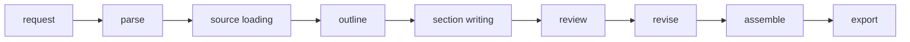

# LongTextAgent

LongTextAgent is a Python 3.11+ project for building a LangChain and LangGraph
agent system that writes long-form reports, project proposals, research plans,
weekly reports, and similar structured documents.

It is designed as a staged writing workflow rather than a single chat prompt:
the system parses a writing request, loads local source material, plans an
outline, writes section by section, reviews consistency, revises, assembles, and
exports the final document.

## Architecture



Core modules:

- `writing_agent.config`: environment-driven settings with safe summaries.
- `writing_agent.llm`: provider adapter for Ollama, OpenAI-compatible APIs, and OpenAI.
- `writing_agent.models`: Pydantic contracts for requests, plans, drafts, reviews, and final output.
- `writing_agent.graph`: LangGraph state, nodes, and workflow assembly.
- `writing_agent.tools`: local document loading and markdown/docx export helpers.
- `writing_agent.prompts`: planner, writer, reviewer, and editor prompt builders.
- `writing_agent.cli`: Typer command line interface.

## Installation

Use Python 3.11 or newer.

```bash
python -m venv .venv
source .venv/bin/activate
python -m pip install -U pip
python -m pip install -e ".[dev]"
```

On Windows PowerShell:

```powershell
python -m venv .venv
.\.venv\Scripts\Activate.ps1
python -m pip install -U pip
python -m pip install -e ".[dev]"
```

Run checks:

```bash
ruff check .
pytest
```

## Environment

Copy `.env.example` to `.env` and edit values as needed. Do not commit `.env`.

```env
LLM_PROVIDER=ollama
OLLAMA_BASE_URL=http://localhost:11434
OLLAMA_MODEL=qwen3.6:35b

EMBEDDING_PROVIDER=ollama
OLLAMA_EMBEDDING_MODEL=qwen3-embedding:8b

OPENAI_API_KEY=
OPENAI_BASE_URL=
OPENAI_MODEL=

DATA_DIR=./data
OUTPUT_DIR=./outputs
CHECKPOINT_DB_PATH=./outputs/checkpoints.sqlite
```

Provider modes:

- `LLM_PROVIDER=ollama`: uses `langchain_ollama.ChatOllama`.
- `LLM_PROVIDER=openai_compatible`: uses `langchain_openai.ChatOpenAI` with `OPENAI_BASE_URL`.
- `LLM_PROVIDER=openai`: uses `langchain_openai.ChatOpenAI` with the default OpenAI API.

The code never hardcodes API keys and the default `.gitignore` excludes `.env`,
local data, checkpoints, caches, and generated outputs.

## Ollama

Start Ollama and make sure the configured model exists:

```bash
ollama serve
ollama pull qwen3.6:35b
ollama pull qwen3-embedding:8b
```

If you expose Ollama over an SSH tunnel, set:

```env
OLLAMA_BASE_URL=http://localhost:11434
OLLAMA_MODEL=qwen3.6:35b
```

Check the configured chat model:

```bash
writing-agent check-model
```

Or without installing the console script:

```bash
python -m writing_agent.cli check-model
```

## CLI Usage

Generate example request files:

```bash
writing-agent init-example
```

Run a writing workflow with local sources:

```bash
writing-agent run \
  --topic "智慧林务系统建设计划书" \
  --type proposal \
  --audience "项目负责人和技术评审" \
  --length "5000字" \
  --style "正式、技术导向、少空话" \
  --source ./data/forestry_notes.md \
  --output-format markdown
```

The workflow writes a timestamped file to `OUTPUT_DIR`, which defaults to
`./outputs`.

Supported source file types:

- `.md`
- `.txt`
- `.docx`
- `.pdf`

Large source files are truncated for the first implementation to avoid
overloading the model context. The loader returns normalized source notes with
`path`, `title`, `content_preview`, and `full_text`.

## Checkpoints

`build_workflow()` compiles a LangGraph `StateGraph` with a SQLite checkpoint
saver by default. The database path comes from `CHECKPOINT_DB_PATH`, defaulting
to `./outputs/checkpoints.sqlite`.

For tests or offline smoke runs, call:

```python
run_writing_workflow(request, checkpointer=False, use_llm=False)
```

That path exercises the graph without calling a real LLM.

## Human Review

The state model already includes `awaiting_human_review`, and the workflow is
organized around natural pause points after outline planning and before final
export. The current implementation does not yet expose an interactive review
command; this is reserved for the next iteration.

## Roadmap

- RAG retrieval over local sources with chunking, embeddings, and citations.
- Web search tool integration for fresh external context.
- Human review breakpoints for outline and final draft editing.
- Richer docx export with styles, tables, and references.
- Multi-agent collaboration for planning, drafting, review, and editing roles.
- LangSmith tracing for debugging long workflows.
- Evaluation sets and automatic scoring for structure, faithfulness, and style.

